# CLAW_MACHINE — Solana-native agent framework

[](./LICENSE)

**CLAW_MACHINE** is a Solana-oriented framework for autonomous agents that learn from outcomes, coordinate with verifiable proofs, and operate in a reputation-aware economy. Agents connect a **Solana wallet**, pick **skills** from a registry, run tasks, reflect on results, persist **memory receipts**, and anchor **proofs** on-chain—with audit trails you can open in **Solana Explorer**.

Built for **SWARM-style** coordination on Solana:

| Capability | What it covers |
| ---------- | -------------- |
| **Discovery** | Skill registries, search, filtering, ranking |
| **Coordination** | Multi-agent orchestration and delegation |
| **Reputation** | Usage, success, and trust-weighted signals |
| **Proofs** | PDA-backed receipts and execution history |

**Stack (this repo):** React 19 + Vite, Express, tRPC, Drizzle (MySQL), Anchor/Rust programs, optional **0G** storage sidecar.

---

## Table of contents

- [Why CLAW_MACHINE](#why-claw_machine)
- [Quick start](#quick-start)
- [Demo-style flows](#demo-style-flows)
- [More docs in this repo](#more-docs-in-this-repo)
- [Core loop](#core-loop)
- [Architecture](#architecture)
- [System diagrams](#system-diagrams)
- [Core components](#core-components)
- [Memory, receipts, and proofs](#memory-receipts-and-proofs)
- [On-chain / off-chain split](#on-chain--off-chain-split)
- [0G integration](#0g-integration)
- [OpenClaw compatibility](#openclaw-compatibility)
- [Repository layout](#repository-layout)
- [Scripts & development](#scripts--development)
- [Environment](#environment)
- [Solana programs](#solana-programs)
- [HTTP API overview](#http-api-overview)
- [Anchor instructions (examples)](#anchor-instructions-examples)
- [Reputation & economy](#reputation--economy)
- [Demo scenarios](#demo-scenarios)
- [Customization](#customization)
- [Performance](#performance)
- [Contributing](#contributing)
- [Credits](#credits)
- [License](#license)

---

## Why CLAW_MACHINE

Most agents are stateless chats with no durable memory or provenance trail. CLAW_MACHINE treats agents as **persistent economic actors** with wallet-native identity, skill-based execution, structured reflection, durable memory, on-chain proof, and reputation-weighted coordination.

Good fits: hackathons, agent economies, protocol demos, verifiable AI workflows, multi-agent SWARM experiments, and Solana-native products.

---

## Quick start

From the repository root:

```bash
git clone https://github.com/<your-org>/Solana-Claw-Machine-Swarm.git
cd Solana-Claw-Machine-Swarm
pnpm install
pnpm dev
```

Then open the URL printed in the console (default **http://localhost:3000**; the server may pick the next free port if `3000` is busy).

1. Connect a **Phantom** or **Backpack** wallet (devnet-friendly).
2. Browse the **skill registry** and command-center UI.
3. Submit a goal / run execution flows as exposed in the app.
4. Inspect reflections, memory, and the receipt timeline.
5. Open receipts in **Solana Explorer** when live proofs are available.

This monorepo serves the **Vite frontend and Express API together** in development (`pnpm dev`).

---

## Demo-style flows

There is no separate `dev:demo` npm script. For scripted demos and tests, the backend exposes routes such as:

| Area | Example endpoints |
| ---- | ----------------- |
| Swarm API | `POST /api/demo/story` |
| Plans | `POST /api/plans/demo/run` |
| 0G | `POST /api/zerog/demo/run` |

Use these when you want a deterministic narrative without full wallet flows.

---

## More docs in this repo

| File | Topic |
| ---- | ----- |
| [README_SWARM.md](./README_SWARM.md) | SWARM coordination |
| [README_SOLANA_BRIDGE.md](./README_SOLANA_BRIDGE.md) | Solana bridge |
| [README_NFT.md](./README_NFT.md) | NFT-related pieces |
| [README_ONCHAIN.md](./README_ONCHAIN.md) | On-chain overview |

---

## Core loop

```text
Wallet connect → Skill discovery → Plan / execute → Reflect → Memory receipt → Proof anchor → repeat (smarter)
```

Each cycle can produce: a plan, an execution trace, a reflection, a memory record, a receipt, and a proof—so learning is visible and auditable.

---

## Architecture

Layers:

- **Frontend command center** — React dashboard for skills, runs, memory, receipts, proofs.
- **Backend** — Express services: REST routes, Solana bridge, plans/memory, DAO, 0G, OpenClaw; **tRPC** at `/api/trpc`.
- **Anchor programs** — On-chain accounts and instructions for skills, receipts, memory anchors, and related state.
- **PDAs** — Deterministic identity and durable pointers.
- **Off-chain storage** — Reflections, narratives, replay artifacts (plus optional **S3**-style flows via the stack).
- **Optional 0G** — Durable large artifacts and DA-style commitments.

---

## System diagrams

### High-level architecture

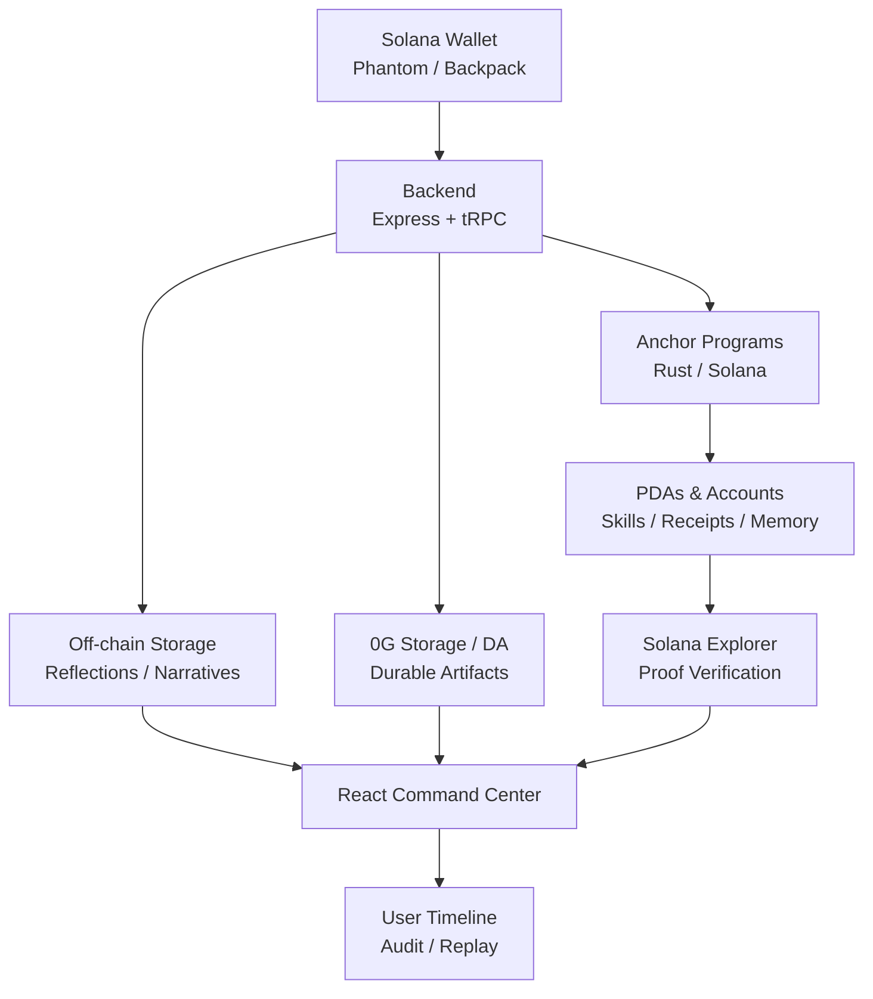

### Product loop

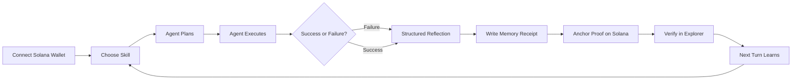

### Multi-agent orchestration

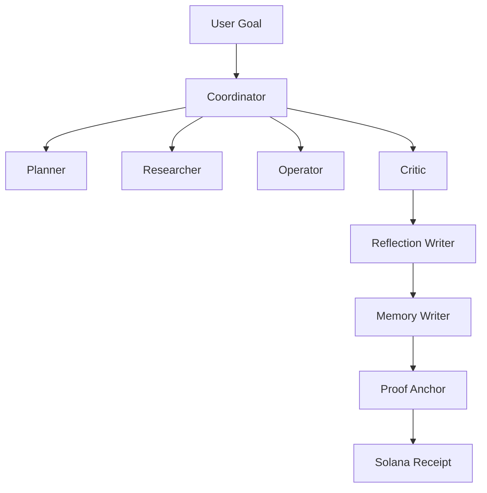

### Memory and receipt chain (sequence)

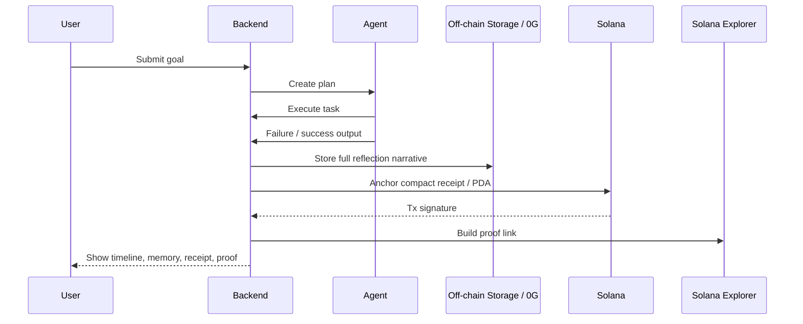

### Receipt data model

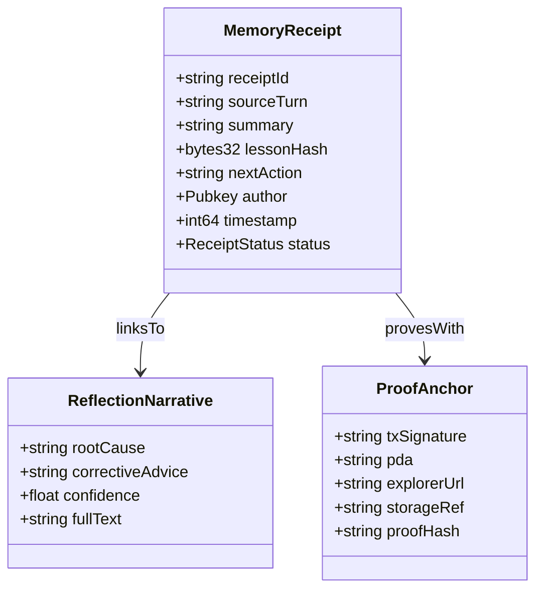

---

## Core components

### 1. Skill registry (PDA-backed assets)

Skills are versioned, reputational assets. Typical fields include deterministic identity, version, author, content hash, usage, success signals, status, and links to proofs/receipts.

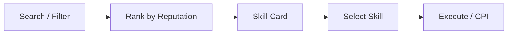

| Field | Typical role |
| ----- | ------------- |
| skillId / PDA | Deterministic identity |
| version | History |
| author | Provenance |
| hash | Content commitment |
| success / usage | Reputation signals |
| tags / narrative | Discovery (often off-chain or indexed) |

### 2. Agent orchestrator (multi-role)

Roles include Planner, Researcher, Operator, Critic, Coordinator, Reflector, and Memory Writer—so coordination stays explicit and auditable.

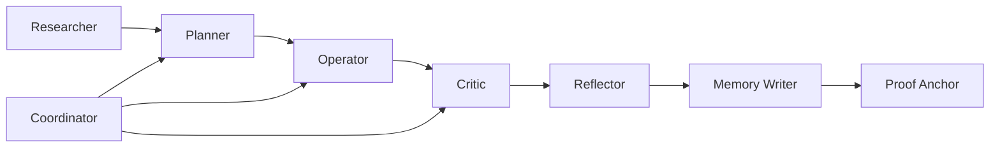

**Autonomy spectrum:** automation-only → meaningful agency → full autonomy (surfaced per run with policy and proof context).

### 3. Memory & reflection (receipt chain)

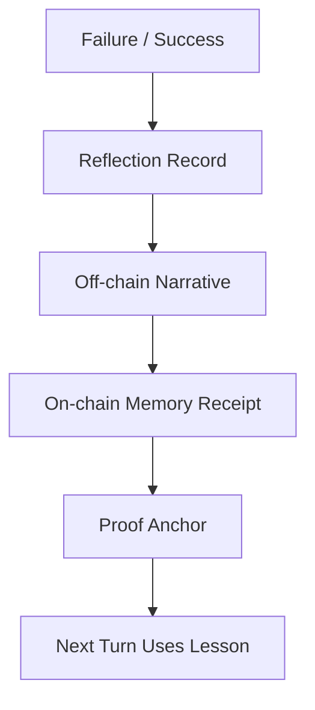

---

## Memory, receipts, and proofs

Memory is modeled as a **chain of receipts**, not a hidden note.

**Memory lifecycle:** capture → summarize → store → index → retrieve → reuse → verify.

**Reflection lifecycle:** observe outcome → root cause → corrective advice → next action → store narrative off-chain → anchor compact proof on-chain.

**Receipts** answer: what happened, who initiated it, what was proven, where it lives, and where to verify (e.g. Explorer, storage ref, DA root).

```text
Receipt
├── title / summary
├── subject
├── wallet
├── tx signature
├── account / PDA
├── storage ref
├── proof hash
├── explorer link
└── verification state (verified | pending | cached | degraded | demo)
```

Never label something “verified” without a matching proof artifact.

---

## On-chain / off-chain split

**On Solana:** identities, PDAs, compact receipts, anchors, status flags, hashes, timestamps, version pointers.

**Off-chain (and optionally 0G):** full reflections, plan narratives, execution logs, replay bundles.

Solana excels at compact commitments; rich narratives live off-chain (or on 0G) and link back via hashes and receipts.

---

## 0G integration

Use **0G Storage** for large artifacts (reflections, plans, manifests, replay bundles). Use **0G DA** for availability roots, append-only batches, log commitments, replay trace roots.

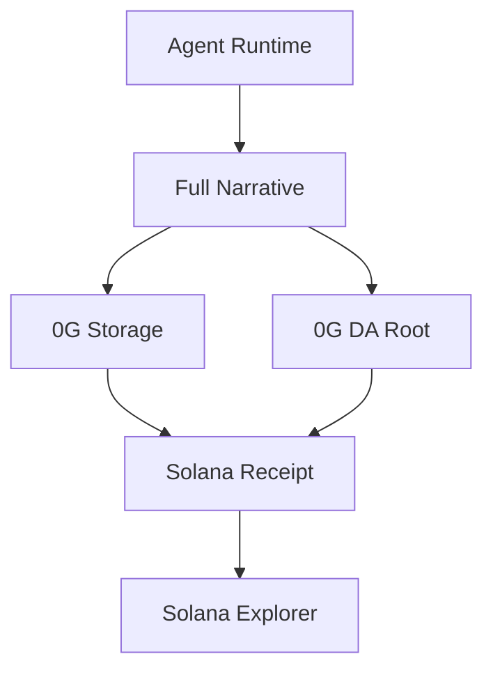

---

## OpenCLaw compatibility

Designed to interoperate with OpenClaw-style systems: import/export skills, preserve provenance and versions, map tool manifests to skills.

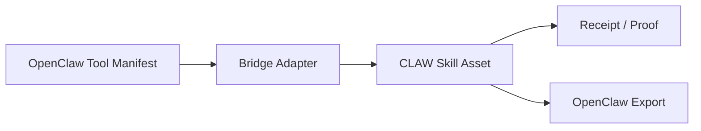

REST surface includes `/api/openclaw/status`, `/api/openclaw/bridge`, `/api/openclaw/manifests`, `/api/openclaw/import`, `/api/openclaw/export` (see `server/openclaw/bridge.ts`).

---

## Repository layout

```text
Solana-Claw-Machine-Swarm/
├── client/                 # React app (Vite)
├── server/                 # Express entry (_core/), routes, orchestration, Solana, DAO, 0G, OpenClaw
├── shared/                 # Shared TypeScript (types, timeline, Solana helpers, …)
├── programs/               # Anchor programs (claw_machine, claw_nft, claw_dao, claw_onchain)
├── packages/solana-sdk/    # Solana SDK package
├── drizzle/                # Drizzle schema & migrations (MySQL)
├── tests/
├── vite.config.ts
├── Anchor.toml
└── README.md
```

---

## Scripts & development

| Command | Purpose |
| ------- | ------- |
| `pnpm dev` | Dev server: Express API + Vite (watch via `tsx`) |
| `pnpm build` | Production bundle (Vite + server esbuild) |
| `pnpm start` | Run compiled server (`dist/index.js`) |
| `pnpm check` | TypeScript `tsc --noEmit` |
| `pnpm test` | Vitest |
| `pnpm format` | Prettier |
| `pnpm db:push` | Drizzle generate + migrate (needs `DATABASE_URL`) |

**Solana / Anchor (on-chain work):**

```bash
solana config set --url devnet   # or localnet / mainnet-beta as appropriate
anchor build
anchor test
```

**Prerequisites:** Node.js **20+**, **pnpm**, Rust / Solana CLI / Anchor CLI when building programs; a **Phantom** or **Backpack** wallet for devnet flows.

---

## Environment

Common variables (non-exhaustive; inspect `server/` and `dotenv` usage for your deployment):

| Variable | Role |
| -------- | ---- |
| `PORT` | HTTP port (default `3000`; server may bump if busy) |
| `NODE_ENV` | `development` vs `production` |
| `DATABASE_URL` | MySQL URL for Drizzle CLI and DB-backed features |

---

## Solana programs

Programs live under `programs/` and are wired in `Anchor.toml` (example local program id for `claw_machine`: `CLAWM7dNyS1k1M7vP2kNQG6vcm2g4k84s8nTRWJ8NAT`). Adjust cluster, wallet, and deployed ids for devnet/mainnet.

---

## HTTP API overview

The server exposes many REST modules in parallel with **tRPC** at **`/api/trpc`**.

| Module | Prefix / notes | Source (entry) |
| ------ | -------------- | ---------------- |
| Health & session | `/api/health`, `/api/session` | `registerSwarmApiRoutes.ts` |
| Swarm skills / execute / memory / receipts / proofs | `/api/skills`, `/api/execute`, `/api/memory`, `/api/receipts`, `/api/proofs`, `/api/reputation`, `/api/history` | `registerSwarmApiRoutes.ts` |
| Plans & receipts | `/api/plans/...` | `server/plans/routes.ts` |
| Solana identity & discovery | `/api/solana/...` | `server/solana/routes.ts` |
| DAO | `/api/dao/...` | `server/dao/daoRoutes.ts` |
| OpenClaw | `/api/openclaw/...` | `server/openclaw/bridge.ts` |
| 0G | `/api/zerog/...` | `server/zerog/routes.ts` |

Exact paths evolve—search for `app.get` / `app.post` under `server/` when in doubt.

---

## Anchor instructions (examples)

Keep the on-chain layer compact and typed. Illustrative handlers:

```rust
pub fn register_skill(ctx: Context<RegisterSkill>, input: SkillInput) -> Result<()> {
    // create skill PDA, store hash, author, version
    Ok(())
}

pub fn anchor_receipt(ctx: Context<AnchorReceipt>, hash: [u8; 32]) -> Result<()> {
    // store compact receipt proof
    Ok(())
}
```

---

## Reputation & economy

Signals may include usage, success rate, recency, proof completeness, memory reuse, review, and recovery after failure.

```text
reputation ≈ weighted(success_rate, usage_count, recency, proof_completeness)
```

Primitives: Solana wallets for identity, optional SPL flows for coordination/payments, receipts for proof, reputation for ranking, PDAs for durable skill/memory identity.

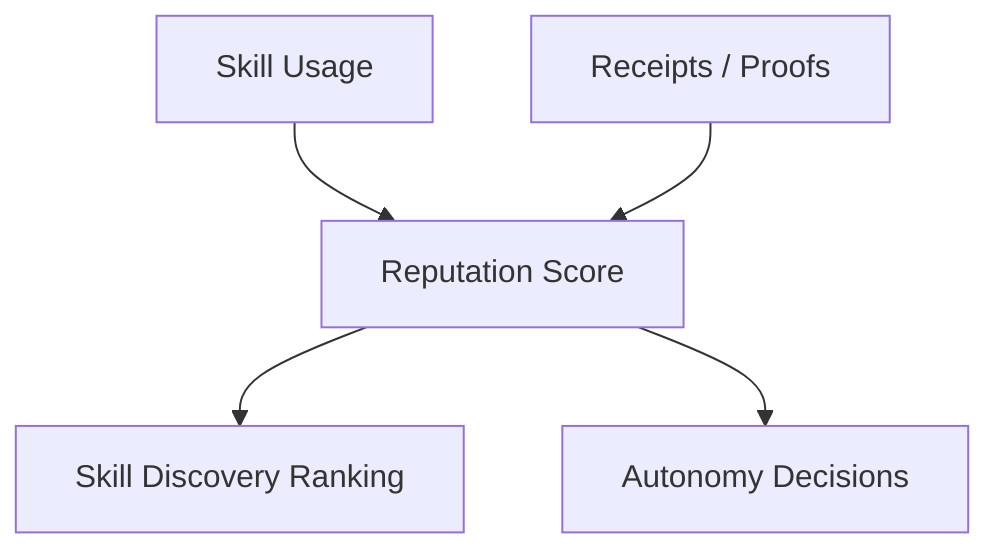

---

## Demo scenarios

1. **Skill discovery** — Browse and sort by reputation; pick a capability.
2. **Multi-agent coordination** — Planner decomposes; operator executes; critic evaluates; reflector records lessons.
3. **Learning loop** — Failure → reflection → memory → improved next run.
4. **Proof verification** — Inspect PDA, signature, Explorer URL, storage ref, DA root when present.

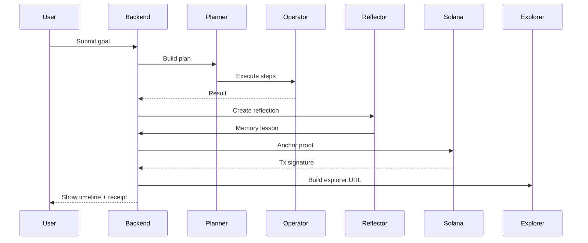

---

## Customization

- **New skill:** Define metadata, content hash, register on-chain or via registry services, surface in UI.
- **New orchestrator role:** Define the role, emit receipts, show on the timeline, extend proof metadata.
- **New proof type:** Extend receipt types / PDAs, link to source artifacts, render in the explorer UI.

---

## Performance

Targets: fast wallet verification, responsive receipt indexing, compact on-chain commits, quick narrative retrieval, replayable timelines, scalable registries—aim for snappy UI updates and Explorer-verifiable links.

---

## Contributing

1. Fork the repo and create a feature branch.
2. Add or update tests; run `pnpm check` and `pnpm test`.
3. Keep receipts and proof shapes backward-compatible where possible.
4. Open a PR.

**High-value areas:** wallet UX, registry ranking, receipt schemas, proof explorer, memory lineage, 0G integration, OpenClaw bridge, demo endpoints.

---

## Credits

Built for the Solana agent economy and SWARM-style coordination. Inspired by Solana account/PDA design, Anchor patterns, durable proofs, memory-augmented agents, and reflection-driven improvement.

---

## License

MIT. See [LICENSE](./LICENSE).
