# CLAW_MACHINE — Solana-Native Agent Framework

CLAW_MACHINE is a **Solana-native agent framework** for building autonomous, self-improving AI agents that learn from failures, coordinate through verifiable proofs, and operate inside a reputation-driven economy.

Agents connect a **Solana wallet**, select a **published skill** from a reputation-weighted registry, execute tasks, reflect on outcomes, store memory as durable receipts, and anchor proofs on-chain — all with full auditability via **Solana Explorer**.

Built for the **SWARM agent economy on Solana**, CLAW_MACHINE supports:

- **Discovery** — skill registries, search, filtering, and ranking
- **Coordination** — multi-agent orchestration and task delegation
- **Reputation** — usage, success, and trust-weighted scoring
- **Proofs** — PDA-backed receipts and verifiable execution history

The framework is designed to run on **devnet**, **testnet**, and **mainnet**, with:
- **Anchor** programs
- **Rust** backend orchestration
- **TypeScript** backend/client glue
- **React** frontend command center
- optional **0G** storage / data availability sidecar for durable artifacts

---

## Table of Contents

- [Why CLAW_MACHINE](#why-clawmachine)
- [Quick Start](#quick-start)
- [Core Loop](#core-loop)
- [Architecture Overview](#architecture-overview)
- [System Diagrams](#system-diagrams)
- [Core Components](#core-components)
- [Memory and Reflection](#memory-and-reflection)
- [Receipts and Proofs](#receipts-and-proofs)
- [Skills and Reputation](#skills-and-reputation)
- [On-Chain / Off-Chain Split](#on-chain--off-chain-split)
- [0G Integration](#0g-integration)
- [OpenClaw Compatibility](#openclaw-compatibility)
- [Project Structure](#project-structure)
- [Installation](#installation)
- [Development](#development)
- [Deployment](#deployment)
- [API Reference](#api-reference)
- [Demo Scenarios](#demo-scenarios)
- [Customization](#customization)
- [Contributing](#contributing)
- [License](#license)

---

## Why CLAW_MACHINE

Most AI agents are stateless chatbots with no durable memory, no provenance, and no proof trail.

CLAW_MACHINE changes that.

It turns agents into **persistent economic actors** with:
- **wallet-native identity**
- **skill-based execution**
- **structured reflection**
- **durable memory**
- **on-chain proof**
- **reputation-weighted coordination**

This makes the system ideal for:
- hackathons
- agent economies
- protocol demos
- verifiable AI workflows
- SWARM-style multi-agent systems
- Solana-native products

---

## Quick Start

Install, connect a wallet, and run your first agent in minutes.

```bash
git clone <YOUR_REPO_URL>
cd CLAW_MACHINE
npm install
npm run dev
````

Then:

1. Connect a **Phantom** or **Backpack** wallet
2. Browse the **skill registry**
3. Submit a goal
4. Watch the agent plan and execute
5. Inspect the reflection, memory, and receipt timeline
6. Open the receipt in **Solana Explorer**

### Demo mode

If you want a fast experience without live on-chain actions, use demo mode:

```bash
npm run dev:demo
```

Demo mode seeds:

* wallet state
* skills
* plans
* execution history
* reflections
* memory receipts
* proof anchors

---

## Core Loop

The product loop is intentionally simple and easy to explain:

```text
Wallet Connect → Skill Discovery → Plan / Execute → Reflect → Memory Receipt → Proof Anchor → Repeat (Smarter)
```

Every cycle produces:

* a plan
* an execution trace
* a reflection
* a memory record
* a receipt
* a proof

That means the agent gets better over time and the proof trail stays visible.

---

## Architecture Overview

CLAW_MACHINE uses a layered architecture:

* **Frontend command center** — React dashboard for skills, runs, memory, receipts, and proofs
* **Backend orchestrator** — TypeScript services that build transactions, index events, and mirror state
* **Anchor programs** — Solana on-chain accounts and instructions for skills, receipts, memory anchors, and proof records
* **PDAs and accounts** — deterministic identity and durable state
* **Off-chain storage** — long-form reflections, execution narratives, and replayable artifacts
* **Optional 0G sidecar** — durable storage and data availability for large artifacts and logs

---

## System Diagrams

### 1) High-level system architecture

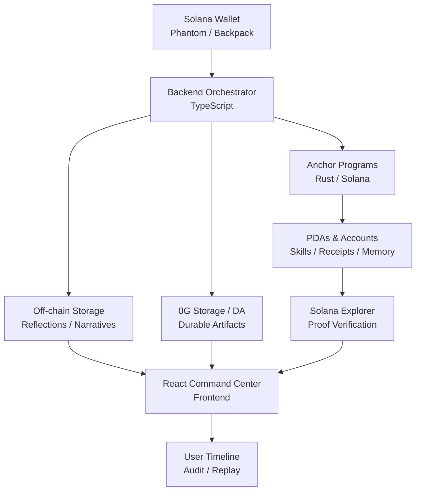

### 2) Product loop diagram

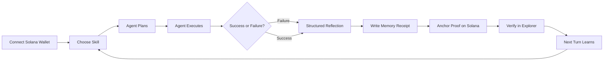

### 3) Multi-agent orchestration diagram

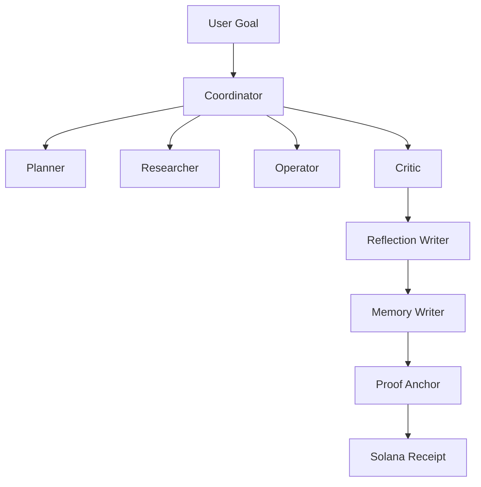

### 4) Memory and receipt chain

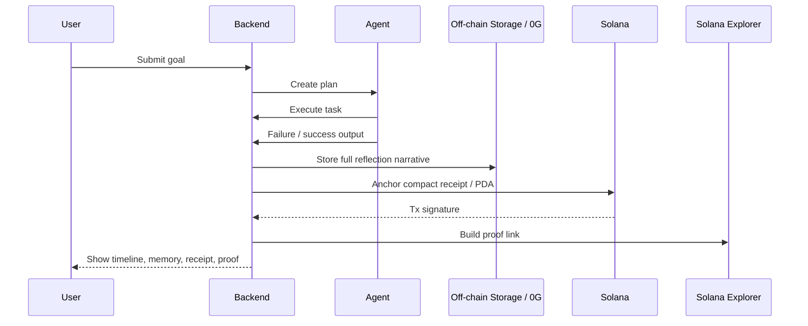

### 5) Receipt data model

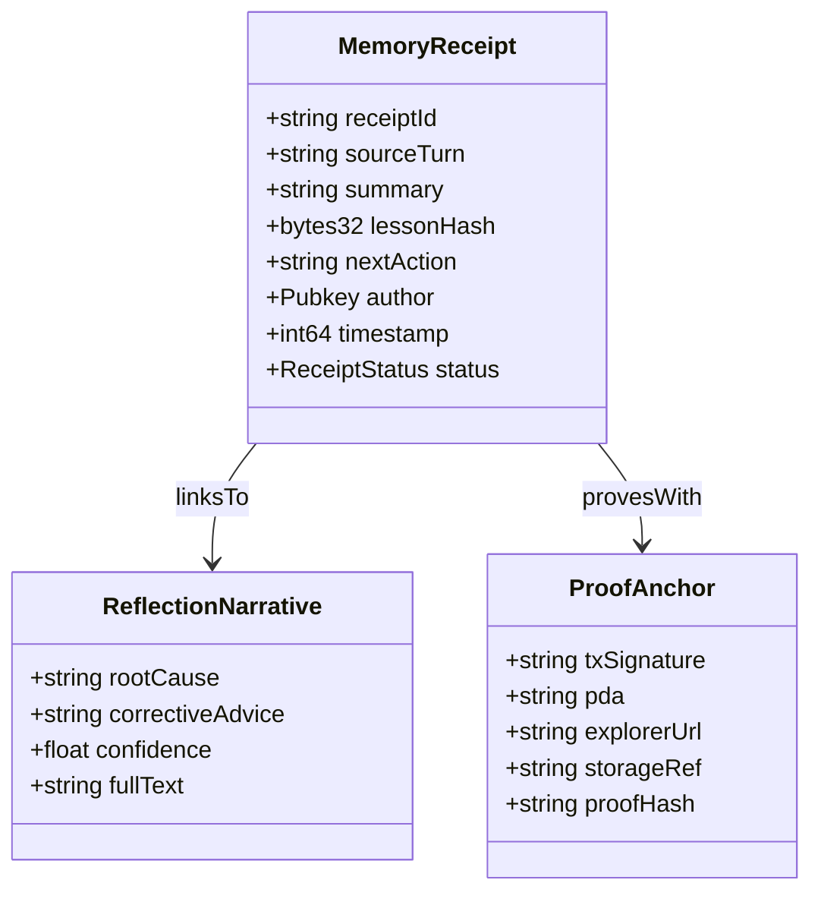

---

## Core Components

### 1. Skill Registry (PDA-backed assets)

Skills are versioned, reputational assets on Solana.

Each skill includes:

* deterministic identity
* version number
* author wallet
* content hash
* usage count
* success rate
* status
* proof/receipt links

#### Skill registry flow

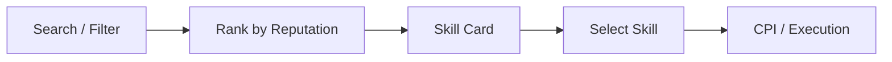

#### Skill fields

| Field       | Type        | On-chain? | Purpose                    |
| ----------- | ----------- | --------- | -------------------------- |
| skillId     | PDA         | Yes       | Deterministic identity     |
| version     | u64         | Yes       | Version history            |
| author      | Pubkey      | Yes       | Provenance                 |
| hash        | [u8;32]     | Yes       | Content proof              |
| successRate | u16         | Yes       | Reputation signal          |
| usage       | u64         | Yes       | Popularity                 |
| tags        | Vec<String> | Off-chain | Discovery                  |
| narrative   | String      | Off-chain | Human-readable explanation |

---

### 2. Agent Orchestrator (multi-role system)

The agent system supports explicit roles:

* Planner
* Researcher
* Operator
* Critic
* Coordinator
* Reflector
* Memory Writer

This makes coordination visible and auditable.

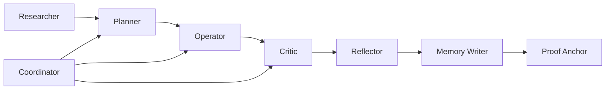

#### Autonomy spectrum

* **Automation only**
* **Meaningful agency**
* **Full autonomy**

Each run can show its autonomy level, policy state, and proof trail.

---

### 3. Memory & Reflection (receipt chain)

Failures become structured lessons.

The memory chain is:

1. Task outcome
2. Reflection
3. Memory receipt
4. Proof anchor
5. Next-turn improvement

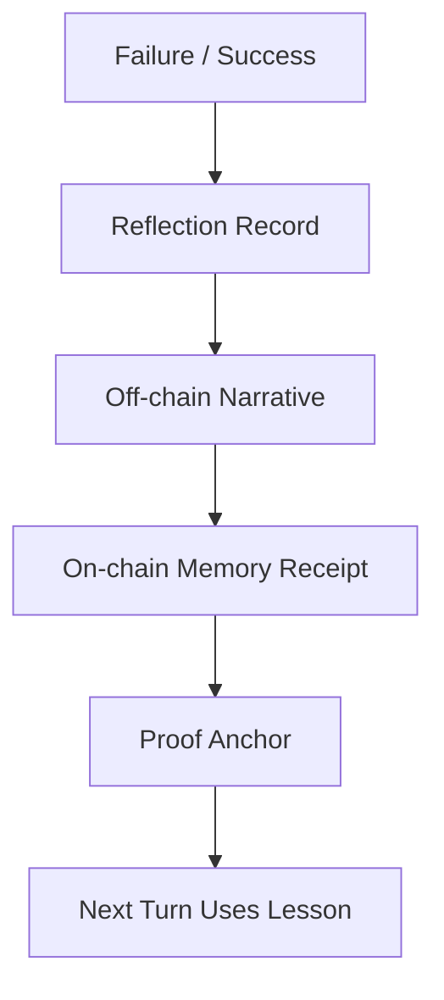

---

### 4. Proofs and Receipts

Receipts are compact, verifiable objects that prove important events occurred.

Receipts can represent:

* skill publication
* skill update
* plan creation
* execution
* reflection
* memory write
* proof anchor

Each receipt should include:

* receipt ID
* subject ID
* wallet
* timestamp
* tx signature
* account / PDA
* proof state
* explorer link

---

## Memory and Reflection

CLAW_MACHINE treats memory as a **chain of receipts**, not a hidden note.

### Memory lifecycle

* captured
* summarized
* stored
* indexed
* retrieved
* reused
* verified

### Reflection lifecycle

* failure or success observed
* root cause identified
* corrective advice generated
* next action proposed
* narrative stored off-chain
* compact proof anchored on-chain

This allows the system to learn over time while keeping the proof trail auditable.

---

## Receipts and Proofs

Receipts are the backbone of the framework.

A receipt should answer:

* what happened
* who initiated it
* what was proven
* where it was stored
* where it can be verified

### Receipt structure

```text
Receipt
├── title
├── summary
├── subject
├── wallet
├── tx signature
├── account / PDA
├── storage ref
├── proof hash
├── explorer link
└── verification state
```

### Verification states

* verified
* pending
* cached only
* degraded
* demo only

Never present a claim as verified unless there is a proof artifact to support it.

---

## On-Chain / Off-Chain Split

The architecture deliberately separates proof from narrative:

### On-chain

Use Solana for:

* identities
* PDAs
* receipts
* proof anchors
* status flags
* hashes
* timestamps
* version pointers

### Off-chain

Use backend storage or 0G for:

* full reflections
* plan narratives
* execution logs
* replay bundles
* human-readable artifact data

### Why this matters

Solana is best for compact commitments and verifiable state transitions.
Off-chain storage is best for rich, replayable narratives.
Together, they produce a system that is both **trustworthy** and **usable**.

---

## 0G Integration

0G is used as a durable data layer for large agent artifacts.

### Use 0G Storage for:

* long reflections
* execution summaries
* plan details
* skill manifests
* replay bundles
* memory narratives

### Use 0G DA for:

* availability roots
* append-only provenance batches
* log commitments
* replay trace roots
* artifact lineage anchors

### 0G + Solana split

* **Solana**: proof, identity, receipts
* **0G Storage**: full artifact
* **0G DA**: lineage and availability commitments

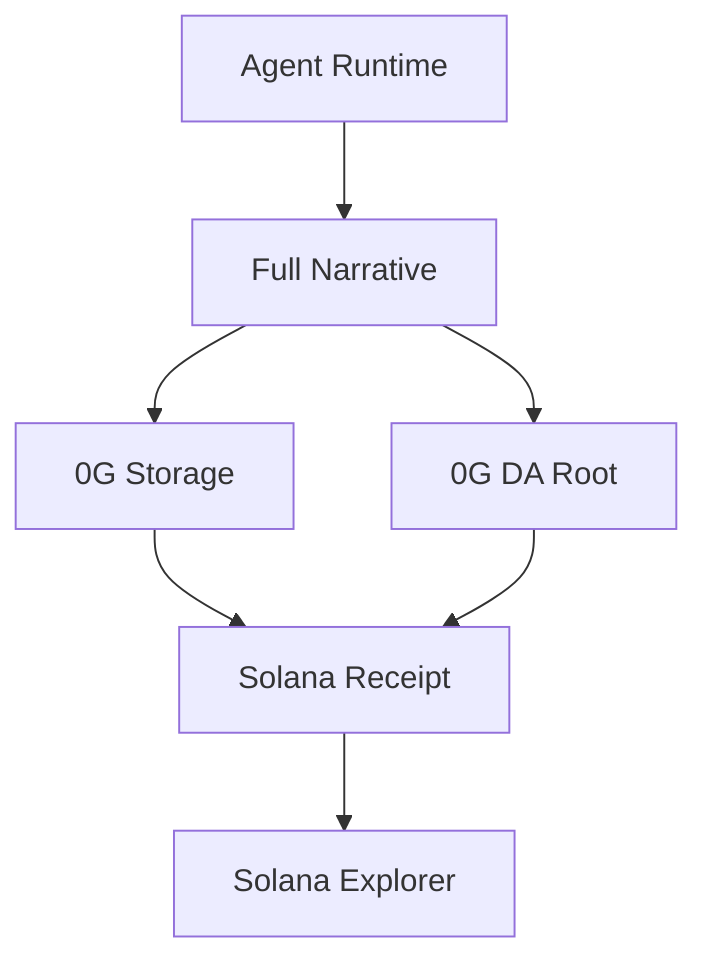

---

## OpenClaw Compatibility

CLAW_MACHINE is designed to interoperate with OpenClaw-style agent systems.

### OpenClaw support includes:

* importing skills
* exporting skills
* preserving provenance
* preserving version history
* preserving reputation signals
* mapping tool manifests to skills

### Bridge flow

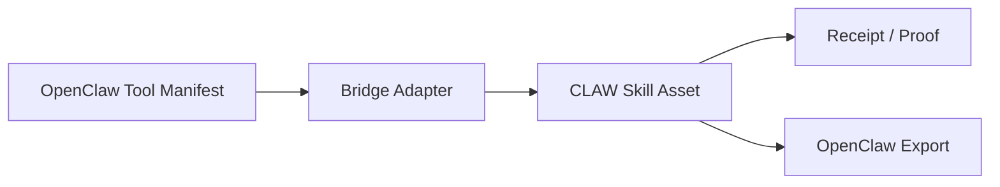

---

## Project Structure

A typical structure looks like this:

```text
CLAW_MACHINE/
├── client/
│   └── src/
│       ├── components/
│       │   ├── solana/
│       │   ├── evm/           # compatibility wrappers
│       │   └── dashboard/
│       ├── contexts/
│       ├── hooks/
│       ├── lib/
│       │   ├── solana/
│       │   ├── zerog/
│       │   └── chain.ts
│       └── pages/
├── server/
│   ├── solana/
│   ├── zerog/
│   ├── openclaw/
│   ├── routers.ts
│   └── db.ts
├── programs/ or anchor/
│   └── claw_machine/
├── shared/
│   ├── types.ts
│   ├── wallet.ts
│   ├── solana/
│   └── zerog/
└── README.md
```

---

## Installation

### Prerequisites

* Node.js 20+
* Rust 1.78+
* Solana CLI
* Anchor CLI
* Phantom or Backpack wallet for devnet

### Install

```bash
git clone <YOUR_REPO_URL>
cd CLAW_MACHINE
npm install
```

### Start development

```bash
npm run dev
```

If you want a faster presentation flow:

```bash
npm run dev:demo
```

---

## Development

### Local Solana development

```bash
solana config set --url devnet
anchor build
anchor test
```

### Frontend

```bash
cd client
npm run dev
```

### Backend

```bash
cd server
npm run dev
```

### Full stack

```bash
npm run dev
```

---

## Deployment

### Devnet

1. Build the Anchor program
2. Deploy to Solana devnet
3. Start backend orchestration
4. Build frontend
5. Configure explorer links and cluster settings

### Mainnet

* ensure receipts are verified
* ensure storage refs are durable
* ensure proof anchors are indexed
* ensure fallback/demo states are disabled or clearly labeled

---

## API Reference

### Skill registry

* `GET /api/skills`
* `GET /api/skills/:id`
* `POST /api/skills/publish`
* `POST /api/skills/:id/update`

### Agent runs

* `POST /api/agents/:id/run`
* `POST /api/plans`
* `POST /api/execution`

### Memory and reflection

* `POST /api/reflections`
* `POST /api/memory`
* `GET /api/memory/:id`

### Receipts and proofs

* `POST /api/receipts`
* `GET /api/receipts/:id`
* `GET /api/proofs/:id`
* `GET /api/explorer/:tx`

### Solana session

* `POST /api/solana/session/nonce`
* `POST /api/solana/session/verify`
* `GET /api/solana/session`

---

## Anchor Instructions

Example instructions might include:

```rust
pub fn register_skill(ctx: Context<RegisterSkill>, input: SkillInput) -> Result<()> {
    // create skill PDA, store hash, author, version
    Ok(())
}

pub fn anchor_receipt(ctx: Context<AnchorReceipt>, hash: [u8; 32]) -> Result<()> {
    // store compact receipt proof
    Ok(())
}
```

Use Anchor to keep the on-chain layer compact, typed, and auditable.

---

## Reputation and Economy

Skills and agents earn reputation based on:

* usage
* success rate
* recency
* proof completeness
* memory reuse
* human review
* failure recovery

### Reputation formula example

```text
reputation = weighted(success_rate, usage_count, recency, proof_completeness)
```

### Economic primitives

* Solana wallets for identity
* SPL tokens for optional coordination / payments
* receipts for proof
* reputation for discovery and ranking
* PDAs for durable skill and memory identity

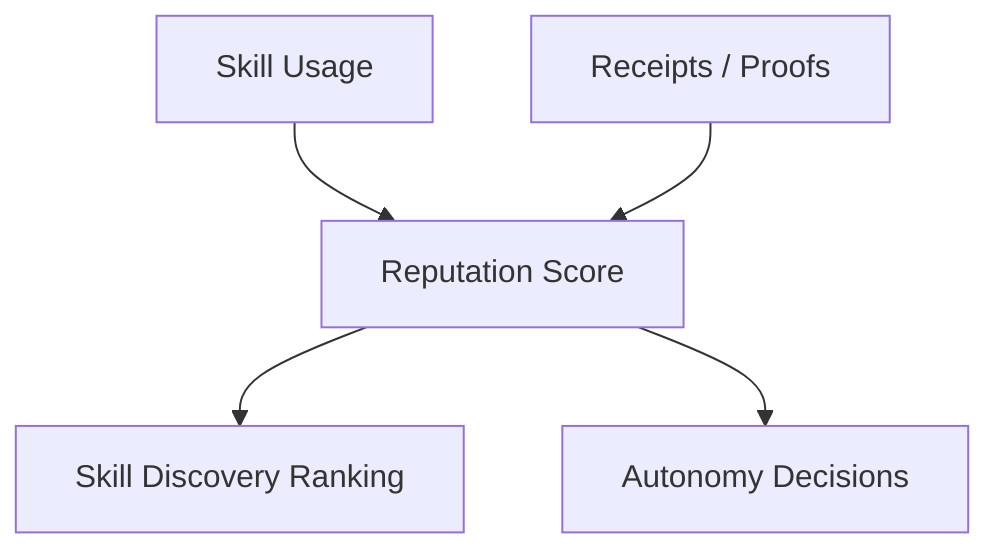

---

## Demo Scenarios

### 1. Skill discovery

Browse skills, sort by reputation, select a top-ranked capability.

### 2. Multi-agent coordination

A planner decomposes a goal; operator executes; critic evaluates; reflector writes a lesson.

### 3. Learning loop

A failure produces a reflection, which becomes memory, which improves the next run.

### 4. Proof verification

Open a receipt and inspect:

* PDA
* tx signature
* Solana Explorer link
* storage reference
* DA root if present

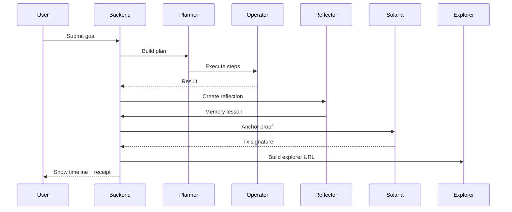

---

## Customization

### Add a new skill

* define the skill metadata
* compute the content hash
* register the skill on-chain or in the registry
* update reputation and versioning
* expose it in the frontend

### Add a new orchestrator role

* define the role
* emit role-specific receipts
* include it in the execution timeline
* add proof metadata

### Add a new proof type

* extend the receipt type
* add a PDA or account
* link it to the source artifact
* display it in the proof explorer

---

## Performance

The architecture is designed for:

* fast wallet verification
* real-time receipt indexing
* compact on-chain commitments
* off-chain narrative retrieval
* replayable timelines
* scalable skill registries

Targets:

* sub-second UI state updates
* low-latency receipt display
* explorer-verifiable proof links
* quick demo rendering

---

## Contributing

Contributions are welcome.

### Suggested workflow

1. Fork the repo
2. Create a feature branch
3. Add or update tests
4. Update shared types
5. Update the frontend and backend together
6. Ensure receipts and proofs remain structured
7. Open a PR

### Good contribution areas

* Solana wallet UX
* skill registry ranking
* receipt structures
* proof explorer
* memory lineage
* 0G storage integration
* OpenClaw interoperability
* demo mode improvements

---

## Credits

Built for the Solana agent economy and SWARM-style multi-agent coordination.

Inspired by:

* Solana account and PDA design
* Anchor program patterns
* durable proof systems
* memory-augmented agents
* reflection-driven improvement
* verifiable AI workflows

---

## License

MIT. See `LICENSE`.
